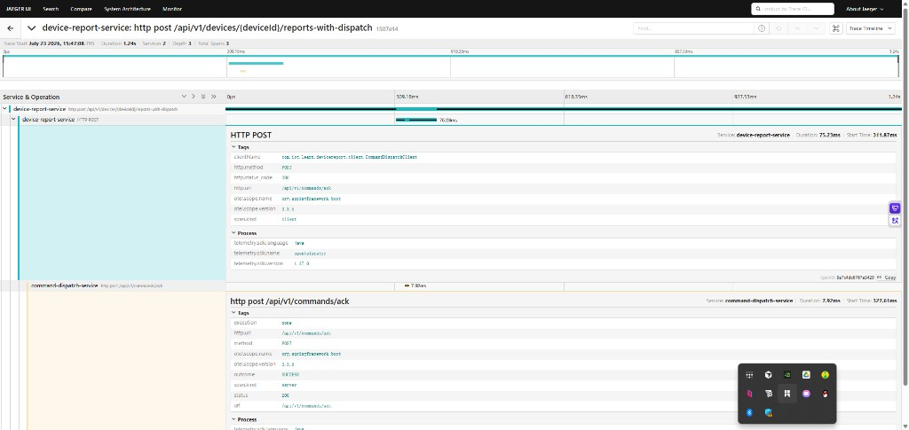
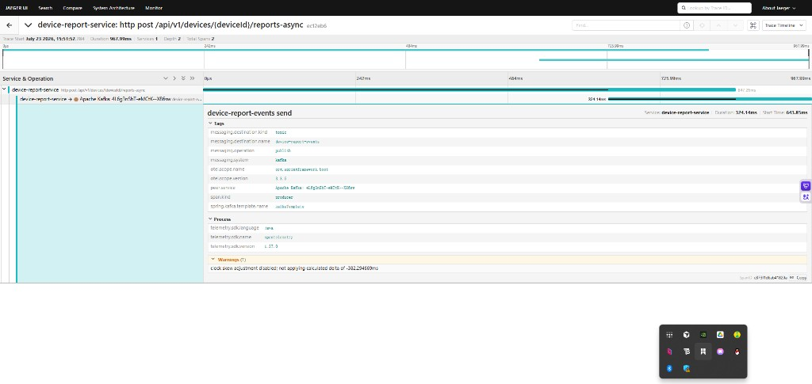

# Stage 2 Tracing Runbook（W8 / Jaeger）

**日期：** 2026-07-23  
**对照计划：** `docs/superpowers/plans/2026-07-23-stage2-w8-jaeger.md`  
**指南：** `docs/superpowers/guides/2026-07-23-stage2-w8-jaeger.md`

---

## 1. 架构（Pod → OTLP → Jaeger）

```text
Ingress / 客户端
  → device-report-service（minikube）
       ├─ Feign → command-dispatch-service
       └─ KafkaTemplate → topic device-report-events
              → device-report-consumer
  各服务 OTLP HTTP → host.minikube.internal:4318
              → Jaeger all-in-one（WSL Docker）
              → UI :16686（Windows 常用 http://192.168.19.64:16686）
```

| 谁 | OTLP endpoint |
|----|----------------|
| minikube Pod | `http://host.minikube.internal:4318/v1/traces` |
| Windows IDEA | `http://192.168.19.64:4318/v1/traces` |

采样（lab）：`management.tracing.sampling.probability: 1.0`

---

## 2. Jaeger 启停（WSL）

```bash
cd /path/to/jaeger   # 含 docker-compose*.yml 与 ./data
sudo chown -R 10001:10001 ./data   # 镜像 UID 10001；仅首次或权限不对时
docker compose up -d
curl -sf http://127.0.0.1:14269/   # admin 健康
# UI: http://192.168.19.64:16686
```

详情：`iot-learn-lab/infra/jaeger/README.md`

---

## 3. UI 怎么读（通用）

| 区域 | 含义 |
|------|------|
| 左侧 Service / Operation | 筛服务与接口；**同一 TraceId** 可在任一参与方 Service 下搜到 |
| 列表「N Spans」 | 这条链路有几段；`1 Span` 通常只有入口 HTTP |
| 点进 Trace：左树 | 父子调用（谁调谁） |
| 横条长短 | 该 span 耗时；总时长在页头 |
| Tags | `span.kind`、`http.*`、`clientName`、`messaging.*` 等 |

**业务同一次请求 ≠ 同一个 TraceId。** 未传播上下文时，上下游会各开一条 Trace，要换 Service 才能分别看到。

---

## 4. 观测记录：Feign（`reports-with-dispatch`）

**请求：** `POST /api/v1/devices/{deviceId}/reports-with-dispatch`  
**观测时间：** 2026-07-23 约 15:47  
**结论：** 已通过（同 TraceId，report + dispatch 同树）

### 4.1 截图



### 4.2 关键参数（摘自该 Trace）

| 项 | 观测值 |
|----|--------|
| 根操作 | `device-report-service: http post .../reports-with-dispatch` |
| Services | **2**（report + dispatch） |
| Total Spans | **5** |
| 总耗时 | ~1.24s |
| Feign client span | `HTTP POST`，`span.kind=client`，~75ms |
| **clientName** | `com.iot.learn.devicereport.client.CommandDispatchClient`（发起 Feign 的接口） |
| http.url（出站） | `/api/v1/commands/ack` |
| http.status_code | 200 |
| 下游 server span | `command-dispatch-service: http post .../ack`，`span.kind=server`，~8ms |

### 4.3 树怎么读

```text
report: POST .../reports-with-dispatch     ← HTTP 入口（整次请求）
  └─ HTTP POST (client)                    ← Feign 出站等待
       └─ dispatch: POST .../ack (server)  ← 下游真实处理
```

- **clientName** = Feign 客户端接口类，不是 Controller。  
- 同一次 `/ack`：client 耗时（含网络/序列化）往往 **大于** server 处理时间；慢不一定在 dispatch 业务里。  
- 优先看：`Duration` 横条、`span.kind`、`http.status_code` / `outcome`、`clientName`、`http.url`。

### 4.4 修通前的对比（已知坑）

未加 `feign-micrometer` 时：report 与 dispatch **同一时刻**各有一条 Trace，但 **TraceId 不同**，Service 下拉里要分别选才能看到——业务同一次调用，追踪上是两棵树。

**修复：** `device-report-service` 增加依赖 `io.github.openfeign:feign-micrometer`，重建并 load 镜像后再测。

---

## 5. 观测记录：Async / Kafka（`reports-async`）

**请求：** `POST /api/v1/devices/{deviceId}/reports-async`  
**观测时间：** 2026-07-23 约 15:51  
**结论：** **producer 侧通过**；本条 Trace **未串上 consumer**（W8 尽力项，记为已知限制）

### 5.1 截图



### 5.2 关键参数（摘自该 Trace）

| 项 | 观测值 |
|----|--------|
| 根操作 | `device-report-service: http post .../reports-async` |
| Services | **1**（仅 report） |
| Total Spans / Depth | **2** / 2 |
| 总耗时 | ~968ms（HTTP 横条约 847ms） |
| 子 span | `device-report-events send` |
| span.kind | **producer** |
| messaging.system | kafka |
| messaging.destination.name | `device-report-events` |
| messaging.operation | publish |
| messaging.destination.kind | topic |
| spring.kafka.template.name | `kafkaTemplate` |
| producer 耗时 | ~324ms（约在 HTTP 开始后 ~642ms 处开始） |
| Warnings | clock skew adjustment disabled（lab 可忽略） |

### 5.3 树怎么读

```text
report: POST .../reports-async
  └─ device-report-events send (producer)   ← 发到 Kafka，不是消费
```

与 Feign 对比：这里停在 **publish**；消费在另一进程，需消息头传播才能进同一 TraceId。

### 5.4 已知限制（Kafka 断链）

| 检查 | 做法 |
|------|------|
| consumer 是否单独有 span | Service 选 `device-report-consumer`，同一时间窗搜索 |
| TraceId 是否与 producer 相同 | 相同 = 已串联；不同 = 仅证明两边都在工作 |
| 本 lab 结业要求 | producer 侧可见即可；consumer 未进同树 **不阻塞**，如实记录 |

已开 `spring.kafka.listener/template.observation-enabled: true`；跨进程仍可能断，属常见限制。

---

## 6. 排障速查

| 现象 | 可能原因 | 处理 |
|------|----------|------|
| 完全无业务 Service | 镜像无 tracing / OTLP 未通 / 采样为 0 | printenv OTEL；Pod curl 4318；采样 1.0 |
| 只有 report，Feign 不同 TraceId | 缺 `feign-micrometer` | 加依赖并 rebuild report |
| Kafka 只有 producer | 传播未打通 | 查 consumer Service；runbook 记限制 |
| UI 仅有 `jaeger-all-in-one` 红点 | Jaeger 自追踪 / SPM 未配 | 可忽略；查业务 Service 名 |
| 同 tag 镜像不更新 | IfNotPresent + Argo 纠偏 | 停 AUTO-SYNC → scale 0 → image rm/load → 再 sync |

---

## 7. 与 Metrics / Logs 对照（面试）

| 支柱 | 回答什么 | 本 lab |
|------|----------|--------|
| Metrics | 聚合：QPS、延迟分位、错误率 | Prometheus |
| Logs | 单机细节、异常栈 | 应用日志 |
| Traces | **一次请求**跨服务路径与哪一段慢 | Jaeger |

例：Prom 显示 `/ack` P99 升高 → 用 Jaeger 找慢 Trace → 看是 Feign client 等待长还是 dispatch server 处理长。

---

## 8. 相关文件

| 路径 | 说明 |
|------|------|
| `infra/jaeger/` | compose + README |
| `device-report-service/pom.xml` | `feign-micrometer` + OTLP |
| `application-k8s.yml`（三服务） | sampling + OTLP endpoint |
| Helm ConfigMap | `OTEL_EXPORTER_OTLP_ENDPOINT` |
| `docs/images/stage2-w8/` | 本 runbook 截图 |
